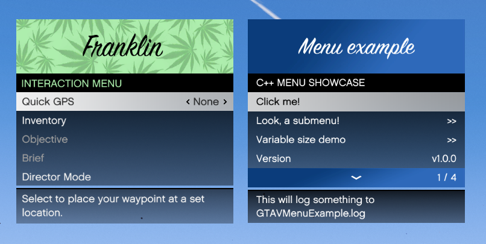

# GTA V Menu   

This menu base was taken from SudoMod base once, but I changed things here and there and now I want to use it in multiple projects, so here's a repo. Full credits to the original authors!



## Building

### Requirements
* [ScriptHookV SDK by Alexander Blade](http://www.dev-c.com/gtav/scripthookv/)
* [simpleini (included as submodule)](https://github.com/brofield/simpleini)

Clone this repository recursively, such that simpleini is cloned with it:  
`git clone --recursive https://github.com/E66666666/GTAVMenuBase`

You'll want to have this repo cloned to your git folder along with where you store your projects. All of my GTA V projects that use this menu, use it in the same way, by having something like `-I../../GTAVMenuBase/` and `-I../../ScriptHookV_SDK/` in their VS Project files.

Just make sure this repo folder is in your additional include files.

Mods using this menu:
* [Manual Transmission](https://github.com/E66666666/GTAVManualTransmission)
* [Addon Spawner](https://github.com/E66666666/GTAVAddonLoader)
* [VStancer](https://github.com/E66666666/GTAVStancer)

Full menu example:
* [GTAVMenuExample](https://github.com/E66666666/GTAVMenuExample)

Since native functions are used, ScriptHookV is needed. ScriptHookV should be extracted into a
`ScriptHookV_SDK` folder parallel to this repo's folder and your mod folder that uses this.

Directory structure example:

```
git
└───ScriptHookV_SDK
│	└───inc
│	└───lib
└───GTAVMenuBase
│	└───thirdparty
│		└───simpleini
└───YourProject
```

## Usage

Check [GTAVMenuExample's implementation](https://github.com/E66666666/GTAVMenuExample/blob/master/GTAVMenuExample/script.cpp) to see the source code.

`update_menu()` is the main update loop. This should be called every tick.

Required methods inside `update_menu()`:
* `CheckKeys`
  * accepts a `MenuControls` pointer and a void `std::function`, so a function is called 
  when the menu gets opened. The function can be `nullptr` if no functionality is desired.
* `EndMenu`
  * Draws all sprites that should be drawn, like backgrounds and check boxes, and draws any
  other additional information.

Required menus and items:
* Main menu
  * Check the description how to do this
* Title
  * You'll need to specify a menu title

For a more complete example (working build), check [GTAVMenuExample](https://github.com/E66666666/GTAVMenuExample).

## Input handling
`MenuControls` does input checking, so it can distinguish between key press, key being pressed, key being released. This applies both to keyboard input (`GetAsyncKeyState`) and native inputs (`IS_DISABLED_CONTROL_PRESSED`). Conflicts/delays between these two shouldn't occur as that's handled in `CheckKeys`: if a GetAsyncKeyState is detected, native controls are temporarily 
blocked. This should prevent ghosting when a menu key is assigned to the same key the game 
navigation controls are binded to.

## Details
There are two detail panes available:
* Info pane to the right
* Details pane below the menu

A menu option with the info pane on the right can be created with `OptionPlus`. You can bind
functions to left/right press, and the original `return-true-when-option-pressed` is also
still available. The pane can be filled with a string vector, where each item represents a new
line. As of now these aren't split automatically yet, so you'll need to manually manage the
line length. It's originally made to show short pieces of information.

Detail panes are available for all option types. It accepts a string vector. Each item in this
vector is automatically split up so it fits nicely within the detail pane. A newline can be
forced by adding more string items to the vector. For normal use a vector with a simple string
should be enough.

## Changes

### Positioning
Since [PR #2](https://github.com/E66666666/GTAVMenuBase/commit/1e67e104453e5d401e6c171aadf8b6b86ae99efd), the Y-positioning of the menu changed. Previously Y = 0.0 used to put the title rectangle half off-screen. Now Y = 0.0 puts the title rectangle flush with the screen.

To match the interaction menu, previously a Y of 0.1 was used. This should now be 0.05.

The X-position stays the same. This means X = 0.0 puts half the menu off-screen, since the center is taken as menu X-position.

Since [commit 6848cfc](https://github.com/E66666666/GTAVMenuBase/commit/6848cfc6a355590a3230839de2c110505630544b), the position is moved to the top left. This makes `(0.0f, 0.0f)` sit flush with the safe zone.

### Methods
OptionPlus had had some changes. As of [commit 3b37182](https://github.com/E66666666/GTAVMenuBase/commit/3b37182181e73c28439838b6107eae53a2844e03), the selected bool pointer is required again.

Since [commit ec9477b](https://github.com/E66666666/GTAVMenuBase/commit/ec9477b0b203efc2fcc83e7dcce33045d2198917), the automatic uppercase menu subtitle argument is gone.

## Remarks
If you're also not using [ScriptHookVDotNet](https://github.com/crosire/scripthookvdotnet) with [NativeUI](https://github.com/Guad/NativeUI) and just want something less painful than the mess that happens in the ScriptHookV Simple Trainer example, I hope this is of some use for you.

This thing started out as something I needed for [VStancer](https://github.com/E66666666/GTAVStancer) 
where unknown modder on GTA5-Mods linked me the SudoMod menu sources. 

Good luck modding! 
