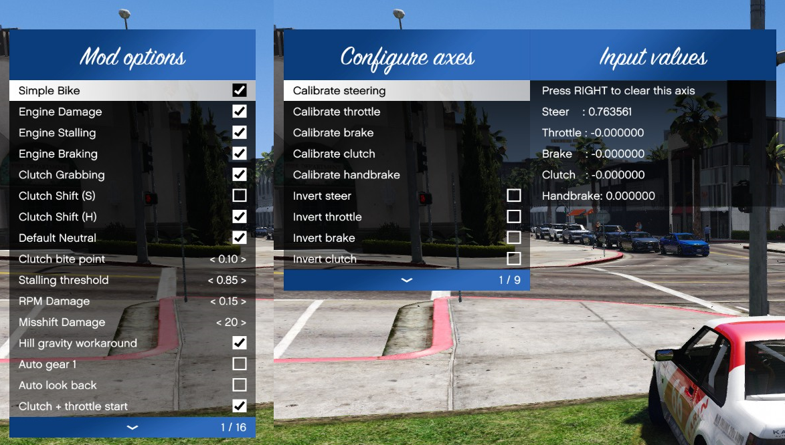

# GTA V Menu   

This menu base was taken from SudoMod base once, but I changed things here and there and now I want to use it in multiple projects so it'll just exist here or whatever. Full credits to those people!



## Building

### Requirements
* [ScriptHookV SDK by Alexander Blade](http://www.dev-c.com/gtav/scripthookv/)

You'll wanna have this repo cloned to your git folder along with where you store your projects. All of my GTA V projects that use a menu (this menu) consume it in the same way, by having something like `-I../../GTAVMenuBase/` and `-I../../ScriptHookV_SDK/` in their VS Project files.

* [Manual Transmission](https://github.com/E66666666/GTAVManualTransmission)
* [Addon Spawner](https://github.com/E66666666/GTAVAddonLoader)
* [VStancer](https://github.com/E66666666/GTAVStancer)
* [Real Time Handling Editor](https://github.com/E66666666/GTAVHandlingEditor)

Since native functions are used, ScriptHookV is needed.

## Usage

Nifty guys, who made this SudoMod menu base. The menu is (imo) rather easy to use. Just start with checking your keys, then your menus and submenus, and finally, tell the menu to draw stuff.

A simple example would be this:

```c++

NativeMenu::MenuControls controls;

void onMain() {
  logger.Write("Menu was opened");
}

void onExit() {
  logger.Write("Menu was closed");
}

void update_menu() {
  menu.CheckKeys(&controls, std::bind(onMain), std::bind(onExit));

  if (menu.CurrentMenu("mainmenu")) {
    menu.Title("Whoopie!");
    
    if (menu.Option("Click me!")) {
      logger.Write("Option was chosen");
    }
    menu.MenuOption("Look, a submenu!", "submenu");
  }
  
  if (menu.CurrentMenu("submenu")) {
    menu.Title("I'm a submenu!");
    std::vector<std::string> extraInfo = {
      "There's also some additional info",
      "You can put descriptions or info here",
      "Each string is a new line",
      "The box expands by itself"
    };
    menu.OptionPlus("Look to the right!", extraInfo);
  }

  menu.EndMenu();
}
```

In which update_menu() is in the main update loopy thing. `CheckKeys` accepts a `MenuControls` pointer and a void `std::function` so stuff can happen when the menu thinks it gets opened.

`MenuControls` does input check things so it can distinguish between key press, key being pressed, key being released. This applies both to keyboard input (`GetAsyncKeyState`) and native inputs (`IS_DISABLED_CONTROL_PRESSED`). Conflicts/delays between these two shouldn't occur as that's handled in `CheckKeys`, but I don't trust myself.

If you're also not using [ScriptHookVDotNet](https://github.com/crosire/scripthookvdotnet) with [NativeUI](https://github.com/Guad/NativeUI) and just want something less painful than the mess that happens in the ScriptHookV Simple Trainer example, I hope this is of some use for you.

Good luck! 
